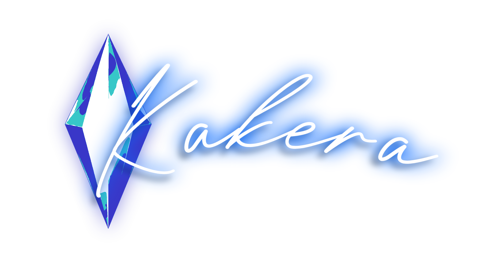
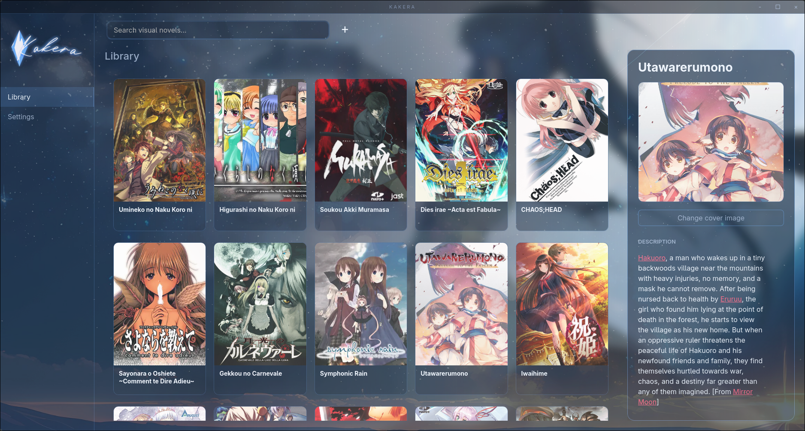
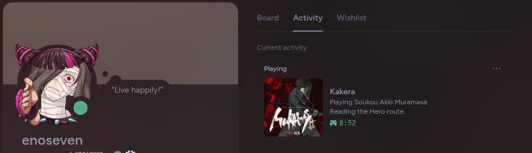

<h1 align="center">Kakera</h1>

<p align="center">
  <a href="https://github.com/enotan/kakera/releases/latest">
    
  </a>
  <a href="https://aur.archlinux.org/packages/kakera">
    
  </a>
  <a href="https://aur.archlinux.org/packages/kakera-bin">
    
  </a>
  <a href="https://github.com/enotan/kakera/blob/main/LICENSE">
    
  </a>
  <a href="https://github.com/enotan/kakera/releases">
    
  </a>
</p>

Kakera is a visual novel library, launcher, and playtime tracker built with Rust and Dioxus-CLI.





## Overview

Kakera works as a hub for launching and keeping track of all your visual novels.
The majority of people use Steam as a central launcher for all their games, but many visual novels aren't available on Steam, and many are forced to buy from other sources which can get hard to keep track of. Kakera lets you add visual novels from VNDB, launch them, show a Discord Rich Presence, and track playtime.

## Features

- Add visual novels manually or search from VNDB
- Browse visual novels in a beautiful cover-art library grid
- View and edit descriptions, notes, routes, and cover images
- Add and track active routes and completed routes
- Allows running visual novels with Wine for Linux operating systems, with settings to change locale and add custom arguments
- Track play sessions and total playtime
- Caches VN cover images locally so internet connection isn't always required to keep a nice looking library
- Shows Discord Rich Presence while a VN is running, customizable in settings
- Stores library and settings as local JSON files

## Supported Platforms

Kakera currently supports:

- Linux
- Windows

macOS isn't supported just yet, as I don't have access to a Mac. But if you own a Mac and want to see it on Mac, please help out!

## Installation

### Windows

```
Download the latest installer from Releases and that's it.
```

### All Linux Distributions

```
Download the latest .AppImage from Releases and that's it.
```

### Arch Linux

```bash
# Kakera is available on the AUR
paru -S kakera

# Binary version
paru -S kakera-bin
```

### NixOS

```
Hopefully coming as a flake soon.
```


## Building from Source

### Dependencies

#### Arch Linux Based Systems

```bash
sudo pacman -S webkit2gtk-4.1 base-devel curl wget file openssl appmenu-gtk-module libappindicator-gtk3 librsvg xdotool xdg-utils rust cargo dioxus-cli
```

#### Debian Based Systems

```bash
sudo apt install rustc cargo libwebkit2gtk-4.1-dev build-essential curl wget file libxdo-dev libssl-dev libayatana-appindicator3-dev librsvg2-dev xdg-utils lld
cargo install dioxus-cli
```

#### Fedora Based Systems

```bash
sudo dnf install webkit2gtk4.1-devel openssl-devel curl wget file libxdo-devel libappindicator-gtk3-devel librsvg2-devel xdg-utils rust cargo
cargo install --locked dioxus-cli
```

#### Optional Runtime Tools

```
# For running Windows visual novels on Linux
wine

# For using Proton
umu-launcher

# For Discord Rich Presence
discord # obviously. vesktop, betterdiscord, etc should all work too
```

### Building

```bash
git clone https://github.com/enotan/kakera

cd kakera

dx build --release
```

## Data Storage

Kakera stores data in the platform app-data directory.

On Linux systems, this is usually:

```text
~/.local/share/kakera
```

On Windows, this is usually:

```text
C:\Users\<USER>\AppData\Roaming\kakera
```

## Planned Features

- Controller navigation mainly for handheld PCs
- Windows locale emulator support
- Fuller notes view with characters (can be imported from VNDB), rich-text formatting and editing (For all the mystery lovers like me)
- Statistics tab with graphs and visualisations of playtime
- More themes + custom theming
- Better UI overall - it's definitely improved a lot but there's still room for improvement


## Tech Stack

- Rust 
- Dioxus for UI
- VNDB HTTP API
- Discord Rich Presence IPC